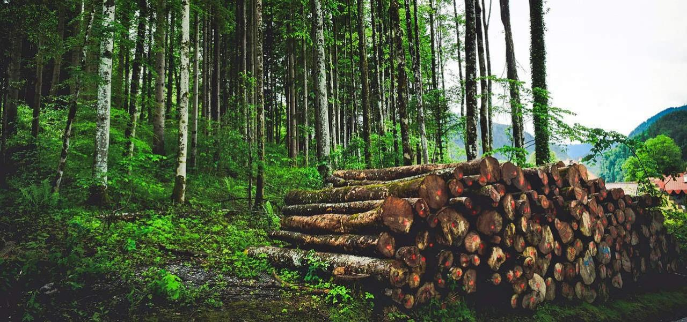
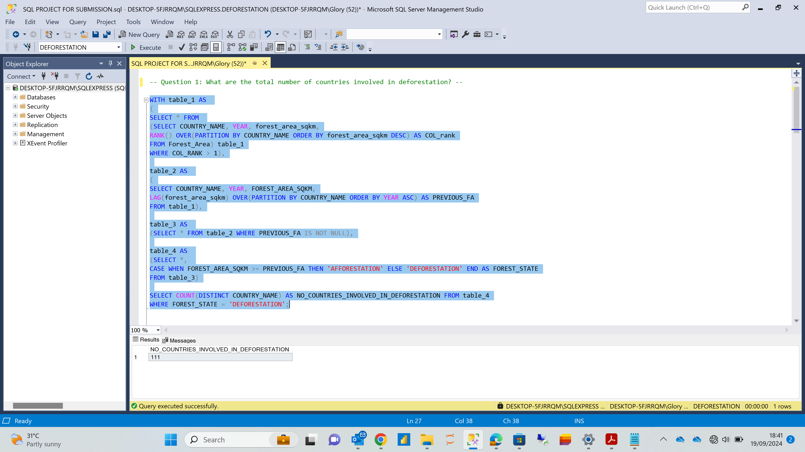
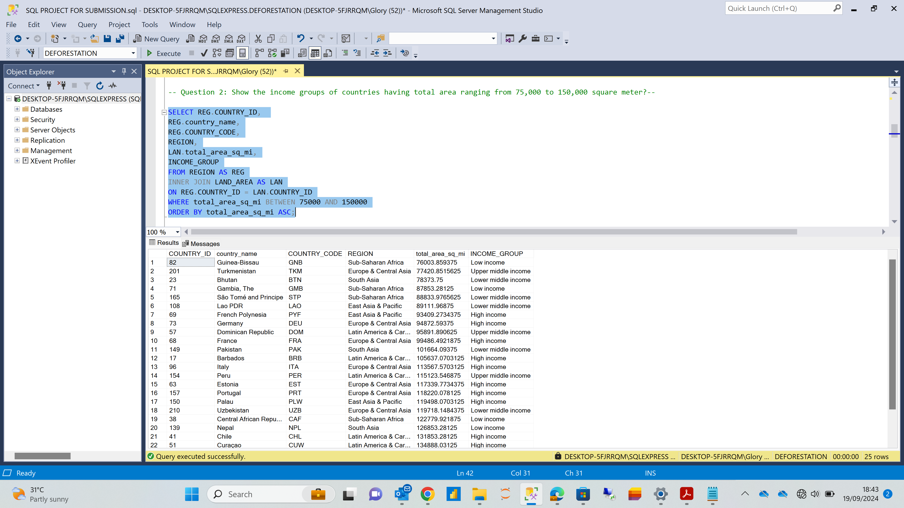
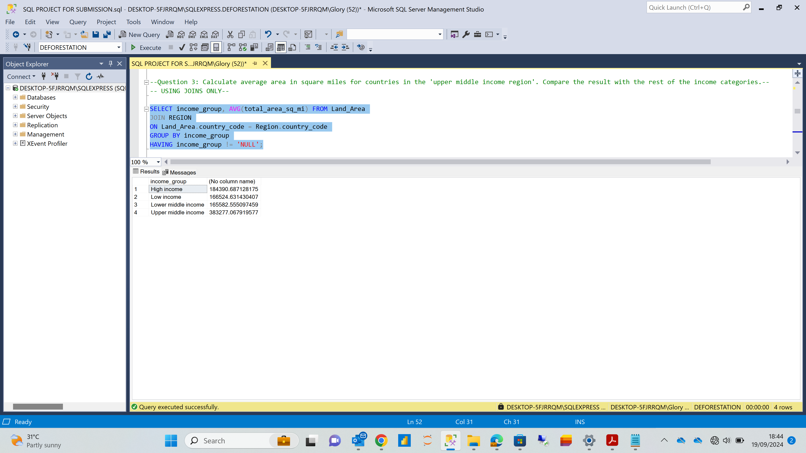
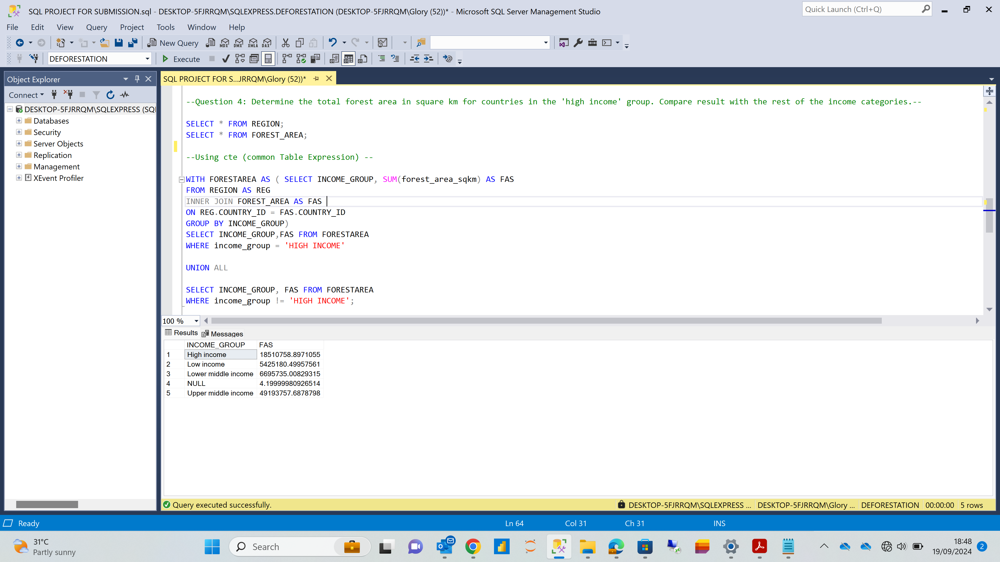
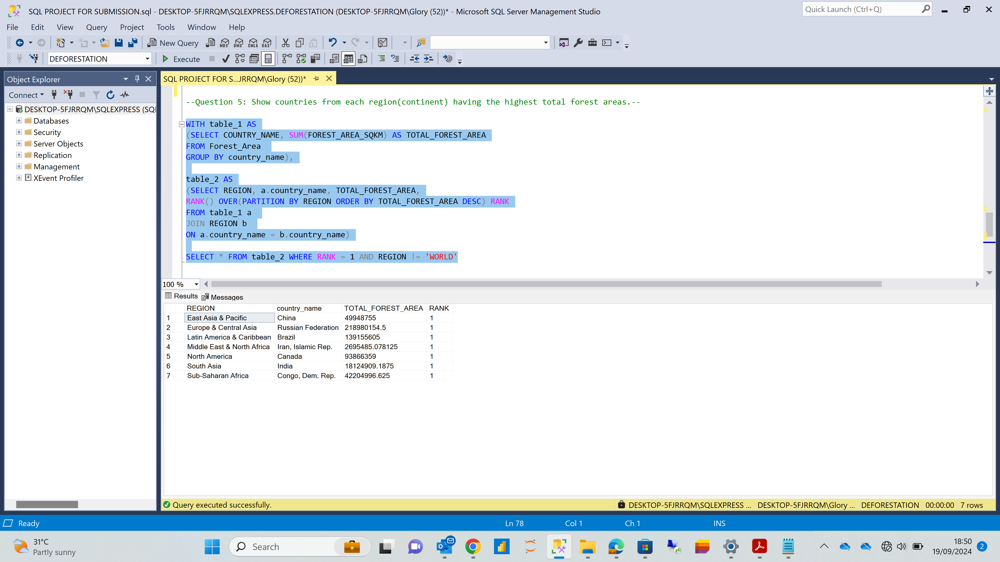

# SQL PROJECT ON DEFORESTATION
#### This Project provides data and analysis on the number of countries involved in deforestation worldwide

## Introduction
Deforestation is a critical environmental issue with widespread consequences for biodiversity, climate, and human societies. This project addresses several key problem statements to analyze deforestation patterns and their socioeconomic dimensions. 
This analysis will provide valuable insights into the extent and distribution of deforestation across different economic and geographic contexts, aiding in the development of targeted conservation strategies.

**_Disclaimer_** : _All Datasets and reports do not represent any company, institution or country, but just a dummy dataset to demonstrate the capabilities of SQL_.

## Problem Statement

1.	What are the total number of countries involved in deforestation?
2.	Show the income groups of countries having total area ranging from 75,000 to 150,000 square meter?
3.	Calculate average area in square miles for countries in the 'upper middle income region'. Compare the result with the rest of the income categories.
4.	Determine the total forest area in square km for countries in the 'high income' group. Compare result with the rest of the income categories.
5.	Show countries from each region(continent) having the highest total forest areas.

## Skills/ Concepts Demonstrated

- Data filtering
- Sql Joins
- Data Aggregation
- Data Cleaning
- CTE (Common Table Expression)
- Database Schema Knowledge( Table relationships)
- Windows Function

## Analysis:
**_Question_** 1.	What are the total number of countries involved in deforestation?

**_Question_** 2.	Show the income groups of countries having total area ranging from 75,000 to 150,000 square meter?

**_Question_** 3.	Calculate average area in square miles for countries in the 'upper middle income region'. Compare the result with the rest of the income categories.

**_Question_** 4.	Determine the total forest area in square km for countries in the 'high income' group. Compare result with the rest of the income categories.

**_Question_** 5.	Show countries from each region(continent) having the highest total forest areas.

